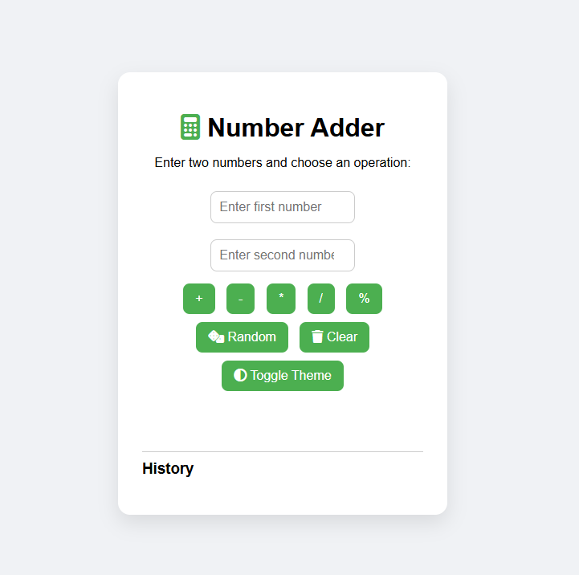
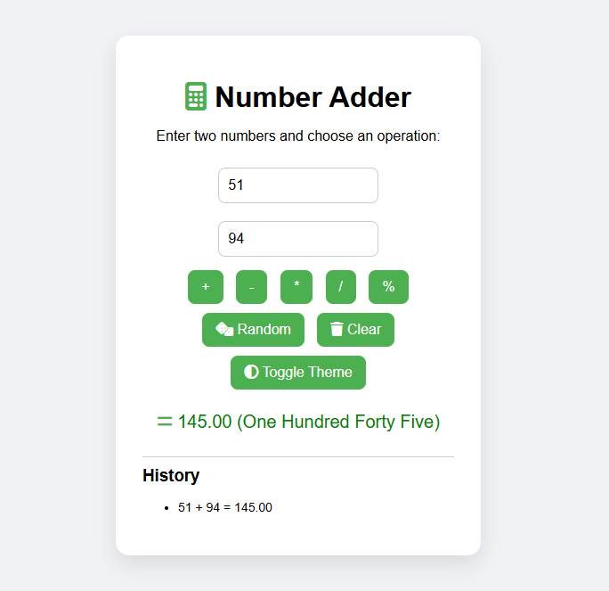
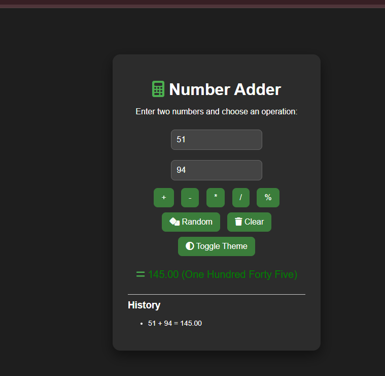

## 🧮 Number Adder Project

A simple, interactive calculator that performs basic operations, shows results in numbers and words, keeps history, supports decimals, random numbers, and theme toggle!

## ✨ Features

➕ Addition, ➖ Subtraction, ✖ Multiplication, ➗ Division, % Modulus

📝 Shows result in words (e.g., 5.33 → Five point Thirty Three)

🕒 Maintains calculation history

🎲 Random number generator for inputs

🧹 Clear inputs and results

🌗 Light/Dark theme toggle

⌨️ Enter key support for quick calculations

## 📸 Demo

 ##🛠 How to Run

Clone the repo:

git clone https://github.com/ifra489/Number-Adds-Project.git

Open the project folder in your editor.

Open index.html in a browser to use the calculator.

## 💻 Technologies Used

HTML5

CSS3 (animations & transitions)

JavaScript (DOM, events, functions)

Font Awesome Icons

## 🚀 Usage

Enter two numbers.

Click an operation (+, -, *, /, %).

Result displays numeric value + words.

Use Random for random numbers.

Click Clear to reset inputs.

Toggle Light/Dark theme.

Press Enter to calculate sum by default.

## 📈 Future Improvements

Support millions & billions in words

Fully responsive mobile layout

Add more advanced math operations

Option to copy results to clipboard

## 📄 License

MIT License © 2026
